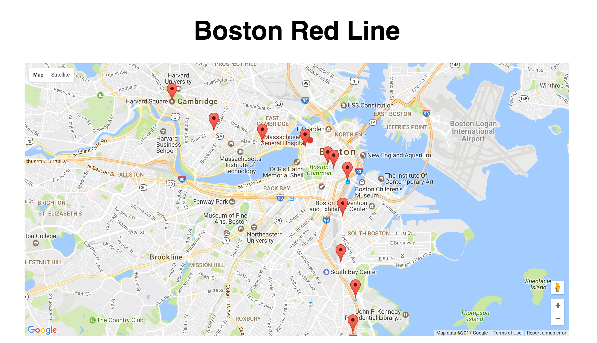
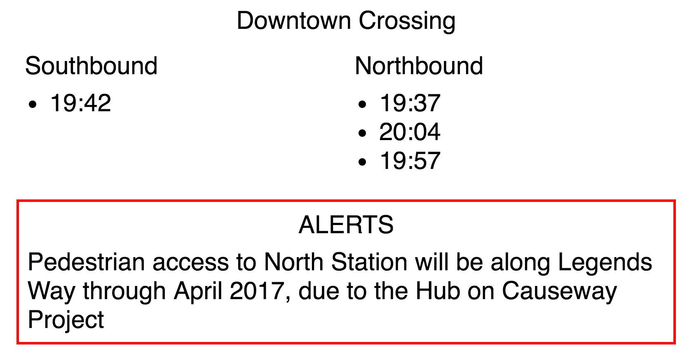

# MBTA-Map - Red Line

Both pages use the Google maps API to display markers denoting the user's current location as well as the stop or train locations. The user's location is found by calling on navigator.geolocation. Train and stop locations are retreived by sending requests to the MBTA-Realtime API. The API documentation can be found [here](http://realtime.mbta.com/Portal/Content/Documents/MBTA-realtime_APIDocumentation_v2_1_3_2017-01-04.pdf "MBTA API Documentation"). 

## trains.html
Shows all trains currently on the redline in realtime by calling on the MBTA's API service.

## stops.html
Shows all stops on the Boston MBTA red line on a Google map and displays the stop name as well as the next departure times underneath the map. The code pulls the stop locations as well as the respective stop's departure trains from the MBTA API. Any Alerts associated with the station are displayed directly under the departure times.

